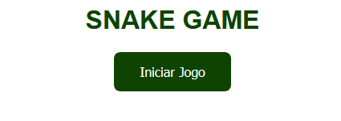

# Jogo da Cobrinha

Minha versão da aula recriando o jogo da cobrinha.
Adicionado botão para iniciar o jogo que some enquanto o jogo está rodando.
Adicionado reset do tamanho da cobrinha e do canvas para reiniciar o jogo no caso de perder.

Adaptado da aula de [Gabriela Pinheiro](https://github.com/SpruceGabriela)

Aula [DIO](https://web.digitalinnovation.one) - FullStack -

